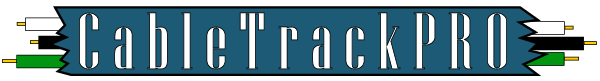

In ICS 314, my team and I worked on a program for our project. This program is called CableTrack, an application meant to track cables during electrical engineering work. It incorporates many things, allowing users to quickly identify which cables were for which company and even which project, granting protection so that unauthorized users cannot see projects, and allowing CEOs to quickly gather information on their projects through the app. 

My role on this project was to implement the cables. This involved creating the data validation for the objects as well as creating the various pages for them, which were add, edit, list, and view. However, I also updated our info page after the project was done and worked on the initial version of the schemas.

While the project was initially difficult, it was thanks to that that I learned a lot from the endeavor. While the most obvious lessons I learned were about how to compartmentalize code to make it easier to both fix and implement, I also learned quite a bit about communication and surprisingly, even a little bit about leadership. Communication was quite important in this project because, without it, we didn't know what another person was doing and would quite often step over someone else's toes. Also, system requirements often weren't communicated effectively so our project had to be rebuilt multiple times, which wasted a lot of time. 

Here is the repository at [Github](https://github.com/ingeniouspartners/cabletrack.pro)
