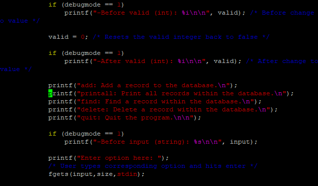

In ICS 212, we had a project and the goal was to make a database for a bank application, implementing both the database and the user interface for the project. 

My role was to plan the project, write out the code, test the code, and debug it all in one. It was a solo project, so of course I was doing all of the work.

From the experience I quickly developed quick coding skills, how to think through a project and develop it, and how to write debugging code for later. I also learned of the importance of databases and the usefulness of user interfaces, as well as the necessity of a debugging system.
